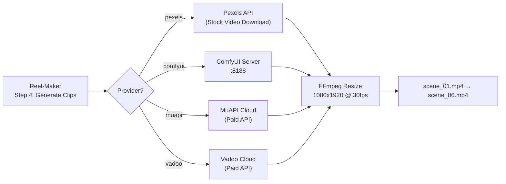
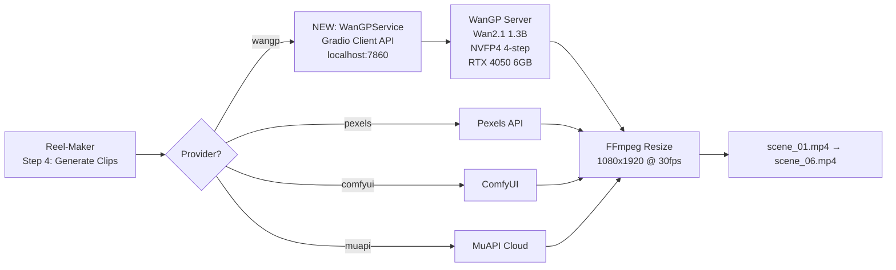
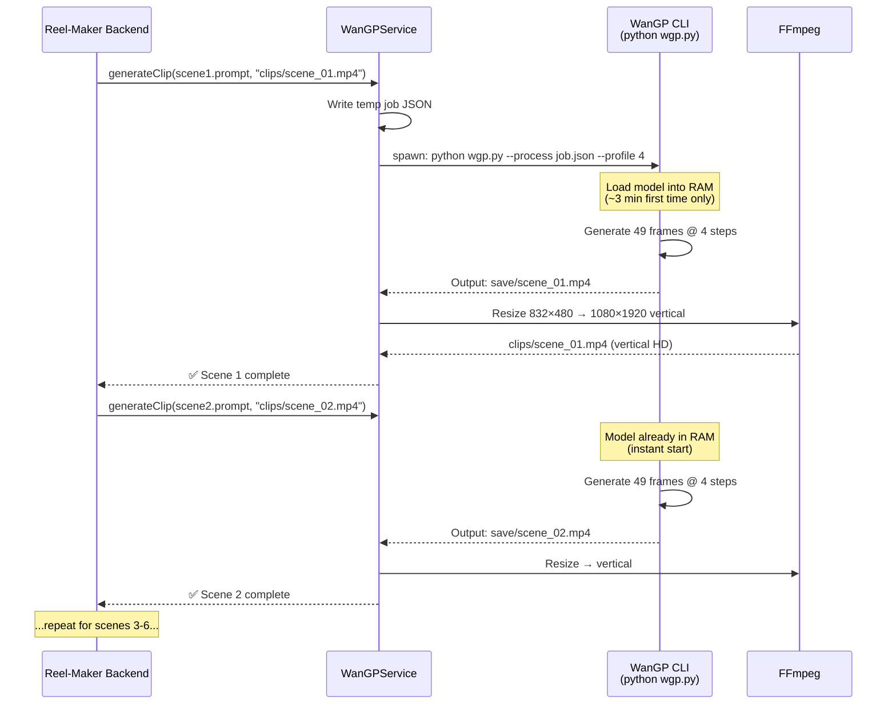

# Integration Study: Reel-Maker ↔ WanGP (Local AI Video Clips)

## Goal
Connect your **Reel-Maker** (`U:\Reel-Maker-Antigravity-Locallly-no-8n`) to your **WanGP** (`U:\GithubRepo\Wan-Model_LowGpu\Wan2GP`) so that during **Step 4 (Clip Generation)**, instead of downloading stock footage from Pexels or calling cloud APIs (MuAPI/Vadoo), the Reel-Maker generates **6 AI video clips locally** using your RTX 4050 GPU and the Wan 2.1 1.3B model.

---

## Current Architecture (How clips are generated today)



### Key Integration Point
The orchestrator's [wizardStep4_Clips](file:///U:/Reel-Maker-Antigravity-Locallly-no-8n/src/backend/orchestrator/PipelineOrchestrator.ts#L225-L348) method accepts a `provider` parameter:
- `'pexels'` → Downloads stock video from Pexels API
- `'comfyui'` → Sends workflow JSON to ComfyUI REST API at `:8188`
- `'muapi'` → Calls MuAPI cloud endpoint
- `'apicalls'` → Calls MuAPI or Vadoo cloud

> [!IMPORTANT]
> **We need to add a new provider: `'wangp'`** that calls WanGP's Gradio API at `http://localhost:7860` to generate each clip locally.

---

## Proposed Architecture (After Integration)



---

## How WanGP Can Be Called Programmatically

WanGP exposes a **Gradio web server** on `http://localhost:7860`. Gradio provides two ways to call it programmatically:

### Option A: Gradio Client API (Recommended)
Gradio automatically exposes a REST-compatible client API. From Node.js/TypeScript:

```typescript
// Using @gradio/client npm package
import { Client } from "@gradio/client";

const client = await Client.connect("http://localhost:7860");
const result = await client.predict("/generate", {
  prompt: "A sleek sports car on a highway at sunset",
  // ... other parameters
});
```

### Option B: CLI Batch Processing (More Reliable for 6 clips)
WanGP supports `--process <file.json>` to process a batch of video generation jobs from a JSON file:

```bash
python wgp.py --process jobs.json --profile 4 --attention sage2
```

Where `jobs.json` contains an array of 6 scene prompts. This is more reliable because:
- No Gradio API complexity
- Processes all 6 clips sequentially (important for 6GB VRAM)
- Outputs MP4 files directly to disk

---

## Detailed Implementation Plan

### Files to Create/Modify

---

### 1. [NEW] `src/backend/services/WanGPService.ts`

A new service class that generates video clips by spawning the WanGP CLI process.

**How it works:**
1. Receives scene prompt + output path + duration
2. Creates a temporary JSON job file for WanGP
3. Spawns `env_uv\Scripts\python.exe wgp.py --process <job.json> --profile 4 --attention sage2`
4. Waits for the output MP4 file to appear
5. Re-encodes to 1080×1920 vertical format via FFmpeg
6. Returns the path

**Key configuration:**
```typescript
interface WanGPConfig {
  wangpDir: string;          // "U:/GithubRepo/Wan-Model_LowGpu/Wan2GP"
  pythonExe: string;         // "env_uv/Scripts/python.exe"
  modelType: string;         // "t2v_1.3B_nvfp4" (Wan2.1 1.3B NVFP4 4-step)
  profile: number;           // 4 (for 6GB VRAM)
  attention: string;         // "sage2"
  inferenceSteps: number;    // 4 (Lightx2v 4-step)
  resolution: string;        // "832x480" → then FFmpeg crops to 1080x1920
  numFrames: number;         // 81 (5 seconds at 16fps)
}
```

---

### 2. [MODIFY] `src/backend/orchestrator/PipelineOrchestrator.ts`

Add `'wangp'` as a new provider option in `wizardStep4_Clips()`:

```diff
 public async wizardStep4_Clips(
   masterPlan: MasterPlan,
   runId: string,
-  provider: 'pexels' | 'comfyui' | 'muapi' | 'apicalls' = 'pexels',
+  provider: 'pexels' | 'comfyui' | 'muapi' | 'apicalls' | 'wangp' = 'pexels',
   ...
 )
```

Add a new `else if (provider === 'wangp')` branch that calls `WanGPService.generateVideoClip()`.

> [!WARNING]
> **Sequential processing is mandatory.** With 6 GB VRAM, WanGP can only generate **one clip at a time**. The orchestrator already processes scenes sequentially in a `for` loop, so this is already handled.

---

### 3. [MODIFY] `src/backend/server.ts`

- Import and instantiate `WanGPService`
- Pass it to `PipelineOrchestrator`

---

### 4. [MODIFY] Frontend UI (Step 4 Wizard)

Add a **"WanGP (Local AI)"** option to the video provider dropdown so users can select it in the UI.

---

## Performance Estimates (6 Clips on RTX 4050)

| Setting | Value |
|:---|:---|
| **Model** | Wan 2.1 Text2Video 1.3B |
| **Preset** | NVFP4 Lightx2v 4-step |
| **Resolution** | 832×480 (16:9) |
| **Frames per clip** | 49 frames (~3 sec) or 81 frames (~5 sec) |
| **Steps** | 4 |
| **Est. time per clip** | ~30–90 seconds |
| **Est. total for 6 clips** | **~3 to 9 minutes** |
| **VRAM usage** | ~4–5 GB (fits in 6 GB) |

> [!TIP]
> Using 49 frames (3 seconds) instead of 81 frames (5 seconds) per clip will be **~2x faster** while still providing enough footage for a 30-second reel with transitions.

---

## Execution Flow (Step by Step)



---

## Open Questions

> [!IMPORTANT]
> ### Questions that will affect implementation:

1. **Clip duration preference**: Do you want **3-second clips** (49 frames, faster) or **5-second clips** (81 frames, higher quality but slower)?

2. **Landscape vs Portrait generation**: WanGP generates landscape (832×480). FFmpeg will crop/resize to portrait (1080×1920). This means some horizontal content gets cropped. Alternative: generate at 448×832 (portrait native) but quality may differ. Which do you prefer?

3. **Model loading strategy**: 
   - **Option A**: Start WanGP server once, keep it running, call via Gradio API (faster for repeated clips, uses ~1.5 GB idle RAM)
   - **Option B**: Spawn WanGP CLI per-batch (6 clips in one JSON), clean exit after batch (no idle RAM usage but ~3 min model load time per batch)

4. **Do you want to keep existing providers** (Pexels, MuAPI) as fallback options, or replace them entirely with WanGP?

---

## Summary

| What | Details |
|:---|:---|
| **Integration method** | New `WanGPService.ts` service + `'wangp'` provider in orchestrator |
| **Communication** | WanGP CLI (`--process job.json`) or Gradio Client API |
| **Files to create** | 1 new service file |
| **Files to modify** | 3 files (orchestrator, server, frontend dropdown) |
| **Hardware requirement** | Already met: RTX 4050 6GB + 16GB RAM |
| **Estimated dev time** | ~2-3 hours |
| **Estimated render time** | ~3-9 minutes for 6 clips |
